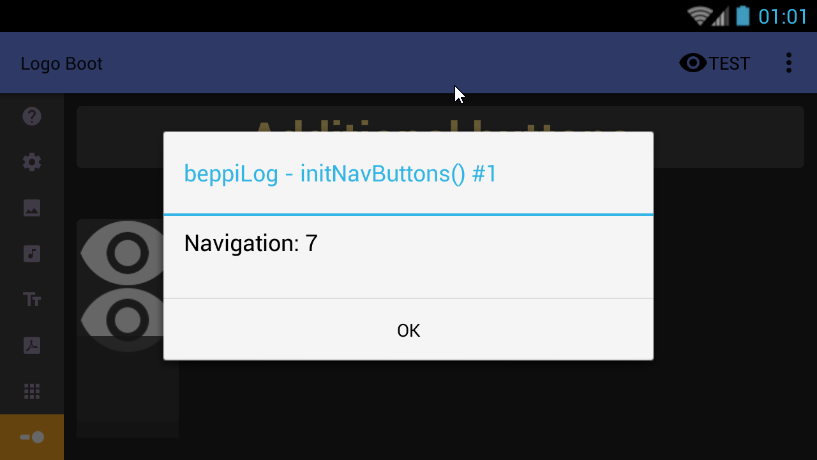
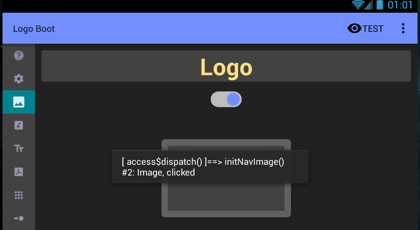

# B-Log

Helper when debugging.
With a single code line can show any kind of datatype in the logcat window, replicate that data in a toast and/or in a dialog window.
Additionally, adds the running method name taken from the stack trace.

### Setup (Gradle)
Add **maven { url "https://jitpack.io" }** in project's build.gradle file.

Add **compile 'com.github.BeppiMenozzi:B-Log:0.0.2'** in module's build.gradle file.

### Usage
Simply add

    BLog.d();
    
to monitor your advancement as if it was a breakpoint. That's it. Put it wherever you like to have a log of what's happening in your code, with more easy-to-read and detailed information than a simple Log.d().

Use
    
    BLog.init();
    
to (optionally) configure it and pass the Context to show toasts and popups in a very easy and fast way.

Use

    BLog.d(...);

to write anything to Log.d, and/or toast, and/or popup dialog.

You can also use

    BLog.toastOnly(...);
    
or

    BLog.popupOnly(...);
    
to quickly debug.

### Example
 
This popup displays
* a tag
* the method name in which it was called
* a serial number (it means that it's the first time it was called)
* a user string
* a user number. 
The same is shown in the logcat window and, optionally, as toast.
 
The code to display this popup was:

At the beginning of the Activity:

    BLog.init(this);
    
Where needed:

    BLog.d("Navigation", 7);

### Another example
 
This toast explains that initNavImage() was called by dispatch() two times. Where needed the code written was:

    Blog.d("Image", "clicked");

### Author

[Beppi Menozzi](http://www.beppi.it)

### License

Copyright 2016 Beppi's App Studios

Licensed under the Apache License, Version 2.0 (the "License");
you may not use this file except in compliance with the License.
You may obtain a copy of the License at

    http://www.apache.org/licenses/LICENSE-2.0

Unless required by applicable law or agreed to in writing, software
distributed under the License is distributed on an "AS IS" BASIS,
WITHOUT WARRANTIES OR CONDITIONS OF ANY KIND, either express or implied.
See the License for the specific language governing permissions and
limitations under the License.

